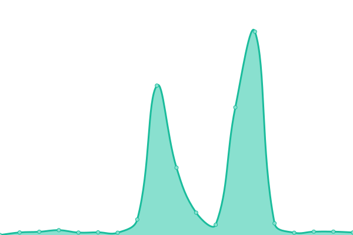
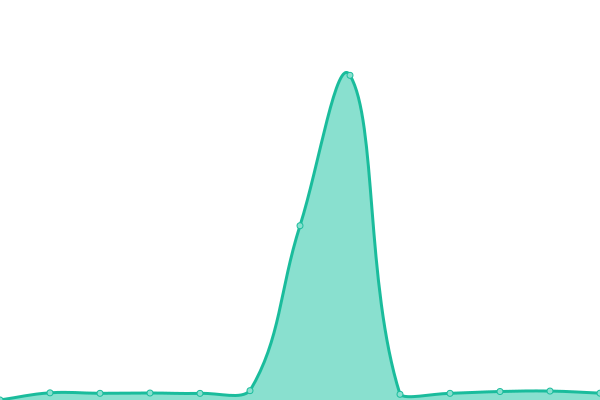
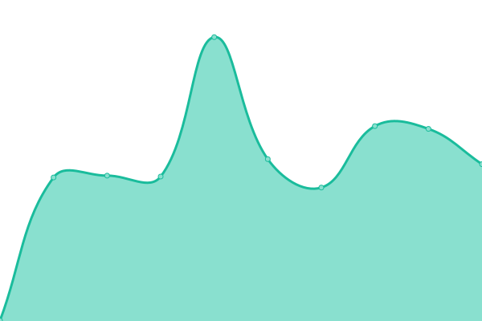

# [📈 Live Status](https://status.visoftware.tech): <!--live status--> **🟧 Partial outage**

This repository contains the open-source uptime monitor and status page for [VI Software](https://visoftware.tech), powered by [Upptime](https://github.com/upptime/upptime).

With [Upptime](https://upptime.js.org), you can get your own unlimited and free uptime monitor and status page, powered entirely by a GitHub repository. We use [Issues](https://github.com/VI-Software/launcher-status/issues) as incident reports, [Actions](https://github.com/VI-Software/launcher-status/actions) as uptime monitors, and [Pages](https://status.visoftware.tech) for the status page.

<!--start: status pages-->
<!-- This summary is generated by Upptime (https://github.com/upptime/upptime) -->
<!-- Do not edit this manually, your changes will be overwritten -->
<!-- prettier-ignore -->
| URL | Status | History | Response Time | Uptime |
| --- | ------ | ------- | ------------- | ------ |
|  [VI Software API](https://api.visoftware.tech/services/servers) | 🟩 Up | [vi-software-api.yml](https://github.com/VI-Software/status/commits/HEAD/history/vi-software-api.yml) | 

 3641ms
     
 | 

<a href="https://status.visoftware.tech/history/vi-software-api">98.81%</a>
    

|  [VI Software Yggdrasil Auth Server](https://authserver.visoftware.tech) | 🟩 Up | [vi-software-yggdrasil-auth-server.yml](https://github.com/VI-Software/status/commits/HEAD/history/vi-software-yggdrasil-auth-server.yml) | 

 2838ms
     
 | 

<a href="https://status.visoftware.tech/history/vi-software-yggdrasil-auth-server">90.34%</a>
    

|  [VI Software CDN](https://cdn.visoftware.tech) | 🟥 Down | [vi-software-cdn.yml](https://github.com/VI-Software/status/commits/HEAD/history/vi-software-cdn.yml) | 

 6270ms
     
 | 

<a href="https://status.visoftware.tech/history/vi-software-cdn">96.89%</a>
    

|  [VI Software PUF](https://puf.visoftware.tech) | 🟩 Up | [vi-software-puf.yml](https://github.com/VI-Software/status/commits/HEAD/history/vi-software-puf.yml) | 

 4006ms
     
 | 

<a href="https://status.visoftware.tech/history/vi-software-puf">98.02%</a>
    

|  [VI Software PUF Nightly](https://nightly-puf.visoftware.tech) | 🟩 Up | [vi-software-puf-nightly.yml](https://github.com/VI-Software/status/commits/HEAD/history/vi-software-puf-nightly.yml) | 

 3812ms
     
 | 

<a href="https://status.visoftware.tech/history/vi-software-puf-nightly">98.14%</a>
    

|  [VI Software Skin Rendering Service](https://skins.visoftware.tech) | 🟩 Up | [vi-software-skin-rendering-service.yml](https://github.com/VI-Software/status/commits/HEAD/history/vi-software-skin-rendering-service.yml) | 

 3395ms
     
 | 

<a href="https://status.visoftware.tech/history/vi-software-skin-rendering-service">98.63%</a>
    

|  [VI Software Docs](https://docs.visoftware.tech) | 🟩 Up | [vi-software-docs.yml](https://github.com/VI-Software/status/commits/HEAD/history/vi-software-docs.yml) | 

 507ms
     
 | 

<a href="https://status.visoftware.tech/history/vi-software-docs">100.00%</a>
    

<!--end: status pages-->

[**Visit our status website →**](https://status.visoftware.tech)

## 📄 License

- Powered by: [Upptime](https://github.com/upptime/upptime)
- Code: [MIT](./LICENSE) © [Anand Chowdhary](https://anandchowdhary.com), supported by [Pabio](https://pabio.com)
- Data in the `./history` directory: [Open Database License](https://opendatacommons.org/licenses/odbl/1-0/)
